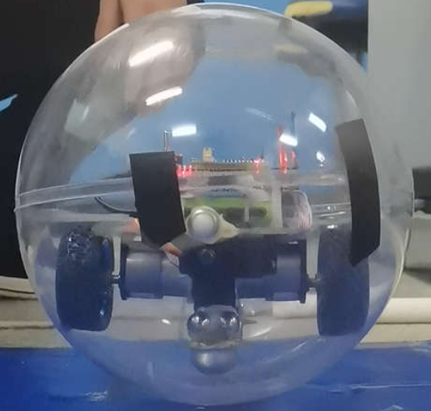
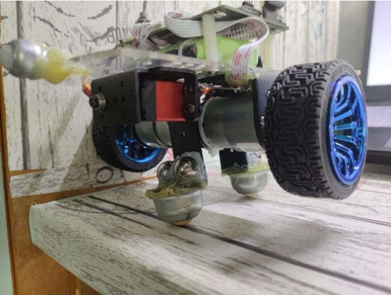
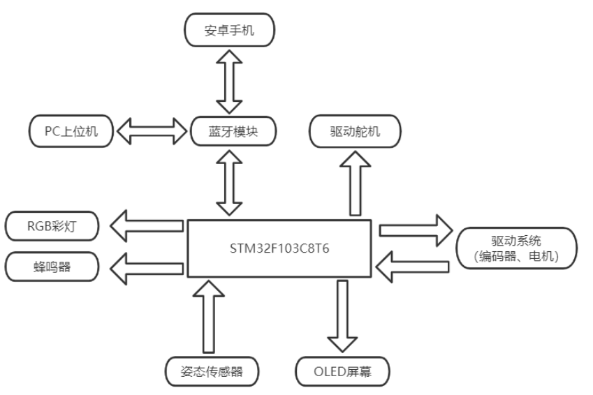

# spherical-car

本项目是个人毕业设计——球形机器人小车	【[球形小车视频](https://www.bilibili.com/video/BV1gJ4m1e7iw/?share_source=copy_web&vd_source=ec1b2dbc65770a3cf1b6920667026d07)】 

## 小车介绍

小车外壳使用亚克力透明空心球体，内部是一个具有两轮的平衡小车主体。另外，为了小车在运动过程中保持左右平衡，在平衡小车前后各增加了一个舵机，驱动配重使其重心改变，以保持车体左右平衡，如下图：

## 整车系统框架

## 仓库简介

仓库包含代码和相应的硬件，目录介绍：

- Code：本项目代码，使用keil打开工程（进入User目录下）
- Pcb：本项目硬件相关文件
  - `板子形状.dxf`：使用CAD绘制的PCB形状
  - `PCB.PcbDoc`：使用Altium Designer 17绘制的PCB文件
  - `原理图.SchDoc`：使用Altium Designer 17绘制的原理图文件
